# BERT- bước đột phá mới trong công nghệ xử lý ngôn ngữ tự nhiên của Google

**BERT** là viết tắt của [Bidirectional Encoder Representations from Transformers](https://arxiv.org/abs/1810.04805) được hiểu là một mô hình học sẵn hay còn gọi là pre-train model, học ra các vector đại diện theo ngữ cảnh 2 chiều của từ, được sử dụng để transfer sang các bài toán khác trong lĩnh vực xử lý ngôn ngữ tự nhiên. BERT đã thành công trong việc cải thiện những công việc gần đây trong việc tìm ra đại diện của từ trong không gian số (không gian mà máy tính có thể hiểu được) thông qua ngữ cảnh của nó.

# 1. Giới thiệu
## 1.1 Sự ra đời của BERT
Các nhà nghiên cứu làm việc tại Google AI tái khẳng định, **sự thiếu hụt dữ liệu đào tạo** là một trong những thách thức lớn nhất trong lĩnh vực xử lý ngôn ngữ tự nhiên. Đây là một lĩnh vực rộng lớn và đa dạng với nhiều nhiệm vụ riêng biệt, hầu hết các tập dữ liệu đều chỉ đặc thù cho từng nhiệm vụ. Để thực hiện được tốt những nhiệm vụ này ta cần những bộ dữ liệu lớn chứa hàng triệu thậm chí hàng tỷ ví dụ mẫu. Tuy nhiên, trong thực tế hầu hết các tập dữ liệu hiện giờ chỉ chứa vài nghìn hoặc vài trăm nghìn mẫu được đánh nhãn bằng tay bởi con người(các chuyên gia ngôn ngữ học). Sự thiếu hụt dữ liệu có nhãn chất lượng cao để đào tạo mô hình gây cản trở lớn cho sự phát triển của NLP nói chung.

Để giải quyết thách thức này, các mô hình xử lý ngôn ngữ tự nhiên sử dụng một cơ chế tiền xử lý dữ liệu huấn luyện bằng việc transfer từ một mô hình chung được đào tạo từ một lượng lớn các dữ liệu không được gán nhãn. Ví dụ một số mô hình đã được nghiên cứu trước đây để thực hiện nhiệm vụ này như **Word2vec**, **Glove** hay **FastText**.

Việc nghiên cứu các mô hình này sẽ giúp thu hẹp khoảng cách giữa các tập dữ liệu chuyên biệt cho đào tạo bằng việc xây dựng mô hình tìm ra đại diện chung của ngôn ngữ sử dụng một số lượng lớn các văn bản chưa được gán nhãn lấy từ các trang web.

Các pre-train model khi được tinh chỉnh lại trên các nhiệm vụ khác nhau với các bộ dữ liệu nhỏ như Question Answering, Sentiment Analysis,...sẽ dẫn đến sự cải thiện đáng kể về độ chính xác cho so với các mô hình được huấn luyện trước với các bộ dữ liệu này.

Tuy nhiên, các mô hình kể trên có những yếu điểm riêng của nó, đặc biệt là **không thể hiện được sự đại diện theo ngữ cảnh cụ thể** của từ trong từng lĩnh vực hay văn cảnh cụ thể.

Tiếp nối sự thành công nhất định của các mô hình trước đó, Google đã công bố thêm 1 kỹ thuật mới được gọi là **Bidirectional Encoder Representations from Transformers(BERT)**. Với lần công bố này(kèm mã nguồn dự án), Google khẳng định bất kỳ ai trên thế giới đều có thể đào tạo được các hệ thống hỏi đáp(Question Answering) cải tiến hơn cho riêng mình hoặc rất nhiều các mô hình NLP khác chỉ bằng 1 vài giờ GPU duy nhất hoặc chỉ khoảng 30p TPU(có thể bạn chưa biết, Google đã cho phép bạn sử dụng TPU của họ 1 cách miễn phí tại Google Colab).

Một số trích dẫn từ các nhà nghiên cứu của Google AI sẽ cho bạn cái nhìn khái quát hơn:

>"BERT is the first deeply bidirectional, unsupervised language representation, pre-trained using only a plain text corpus (in this case, Wikipedia),"

> "Integrating a bidirectional model supports access to context from both past, future and unsupervised directions of data – it can consume data that has not yet been categorized."

Hiện tại, BERT đã có sẵn trên Github và hiện mới chỉ hỗ trợ tiếng Anh nhưng mục tiêu của Google sẽ là phát hành các mô hình được đào tạo trên nhiều ngôn ngữ khác nhau trong tương lai.

## 1.2. BERT có thể biểu diễn ngữ cảnh 2 chiều
Vậy, điều gì làm cho BERT trở lên khác biệt so với các phương pháp trước đây?

Về mặt lý thuyết, các kỹ thuật khác như Word2vec, FastText hay Glove cũng tìm ra đại diện của từ thông qua ngữ cảnh chung của chúng. Tuy nhiên, những ngữ cảnh này là đa dạng trong dữ liệu tự nhiên. Ví dụ các từ như **"con chuột"** có ngữ nghĩa khác nhau ở các ngữ cảnh khác nhau như **"Con chuột máy tính này thật đẹp!!"** và **"con chuột này to thật."** Trong khi các mô hình như **Word2vec**, **fastText** tìm ra 1 vector đại diện cho mỗi từ dựa trên 1 tập ngữ liệu lớn nên không thể hiện được sự đa dạng của ngữ cảnh. Việc tạo ra một biểu diễn của mỗi từ dựa trên các từ khác trong câu sẽ mang lại kết quả ý nghĩa hơn nhiều. Như trong trường hợp trên ý nghĩa của từ con chuột sẽ được biểu diễn cụ thể dựa vào phần trước hoặc sau nó trong câu. Nếu đại diện của từ "con chuột" được xây dựng dựa trên những ngữ cảnh cụ thể này thì ta sẽ có được biểu diễn tốt hơn.

**BERT** mở rộng khả năng của các phương pháp trước đây bằng cách tạo các biểu diễn theo ngữ cảnh dựa trên các từ trước và sau đó để dẫn đến một mô hình ngôn ngữ với ngữ nghĩa phong phú hơn.

## 1.3 Kết quả mà BERT đạt được
Để đánh giá hiệu quả mà BERT đem lại, các kỹ sư thuộc Google AI đã so sánh BERT với các mô hình tốt nhất về NLP trước đây. Điều quan trọng là chúng ta chỉ việc sử dụng BERT thay cho các pre-train model trước đây mà không cần thực hiện bất kỳ thay đổi nào trong kiến trúc mạng neural sâu.

Kết quả là, trên **[SQUAD v1.1](https://rajpurkar.github.io/SQuAD-explorer/)**, BERT đạt được kết quả **F1_score = 93.2%**, vượt kết quả tốt nhất trước đó là **91.6%** và hiệu năng mà con người đạt được là **91.2%**.

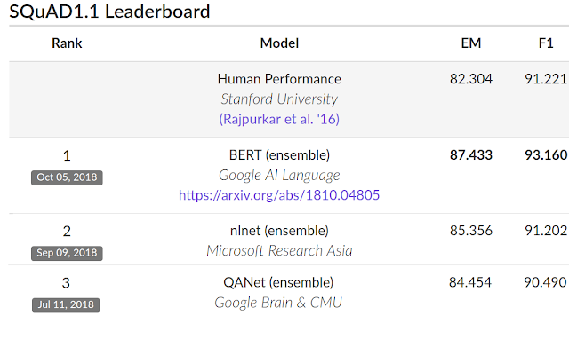

Trên SQUAD v2.0, Top 6 kết quả tốt nhất hiện giờ toàn bộ là của BERT.

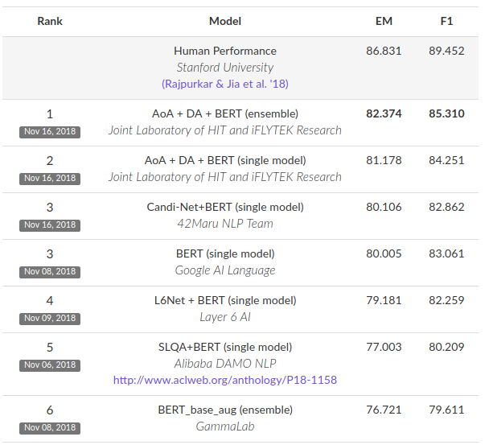

BERT cũng cải thiện được hiệu năng tốt nhất trong thách thức [GLUE benchmark](https://gluebenchmark.com/), một bộ 9 nhiệm vụ **Natural Language Understanding (NLU)**.

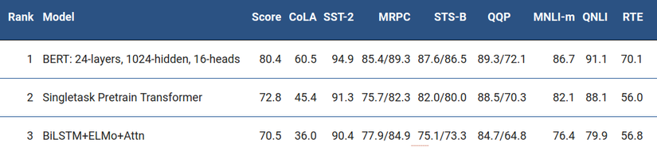

Sau 1 vài tuần ra mắt, BERT gần như đã chiếm top tất cả các nhiệm vụ của xử lý ngôn ngữ tự nhiên từ trước đến nay như 1 lần nữa khẳng định lại sức mạnh của mình. Đây có thể coi là 1 bước nhảy vượt bậc của Google trong lĩnh vực xử lý ngôn ngữ tự nhiên và mình cũng tự hỏi phải chăng đây cũng là 1 cú hích lớn để cải tiến các bài toán trong xử lí ngôn ngữ tự nhiên cho tiếng Việt.

# 2. BERT

Trong phần này, chúng ta sẽ đề cập đến kiến trúc của mô hình BERT và cách xây dựng đầu vào cho BERT, các nhiệm vụ xử lý ngôn ngữ tự nhiên để tạo pre-train model cũng như đề cập tới những sự đổi mới cốt lõi của kỹ thuật này so với các bài báo trước đó.

## 2.1 Kiến trúc
Đầu tiên, ta cùng xem xét tới kiến trúc của mô hình BERT.

Kiến trúc của mô hình BERT là một kiến trúc đa tầng gồm nhiều lớp **Bidirectional Transformer encoder** dựa trên bản mô tả đầu tiên của [Vaswani et al. (2017)](https://arxiv.org/abs/1706.03762) và sự phát hành trong thư viện tensor2tensor. Việc sử dụng các Transformers đã trở nên phổ biến trong thời gian gần đây và vì đây không phải trọng tâm của bài viết này nên chúng ta sẽ cùng xem lại 1 chút về kiến trúc qua các bài viết [Attention is All](http://nlp.seas.harvard.edu/2018/04/03/attention.html) You Need và bài viết Transformer Networks. Có thể mình sẽ đi sâu vào các kiến trúc này qua các bài viết sắp tới.

Trong bài báo này, chúng ta sẽ gọi **L** là số lớp Transformer(blocks) được sử dụng với kích thước của các lớp ẩn là **H** và số heads ở lớp attention là **A**. Trong mọi trường hợp, kích thước của bộ lọc(filter size) luôn được đặt bằng **4H**. Điều này có nghĩa là khi **H = 768** thì **filter size = 3072** và hoặc khi **H = 1024** thì filter **size = 4096**. Báo cáo chủ yếu lấy kết quả trên 2 kích thước mô hình:
- BERT_BASE: **L=12, H=768, A=12, Total Parameters=110M**
- BERT_LARGE: **L=24, H=1024, A=16, Total Parameters=340M**

**BERT_BASE** đã được chọn để có một kích thước mô hình giống hệt như mô hình **OpenAI GPT** để nhằm mục đích so sánh giữa 2 mô hình này. Tuy nhiên, một cách đơn giản để so sánh, BERT Transformer sử dụng các attention 2 chiều trong khi GPT Transformer sử dụng các attention 1 chiều (không tự nhiên, không hợp với cách mà xuất hiện của ngôn ngữ), nơi mà tất cả các từ chỉ chú ý tới ngữ cảnh trái của nó.

Có một chú thích nhỏ rằng, một Transformer 2 chiều thường được gọi là **Transformer encoder** trong khi các phiên bản Transformer chỉ sử dụng ngữ cảnh bên trái thường được gọi là **Transformer decoder** vì nó có thể được sử dụng để tạo ra văn bản. Sự so sánh giữa BERT, OpenAI GPT và ELMo được hiện thị 1 cách trực quan dưới đây:

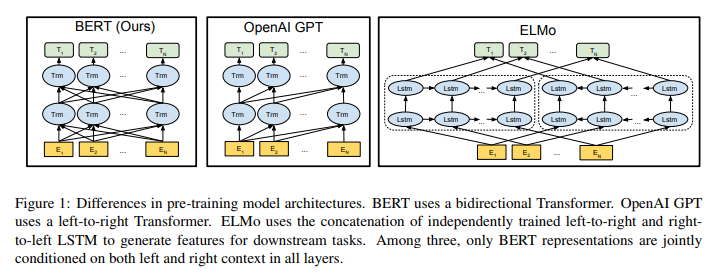

## 2.2 Input Representation
Trong phần này, chúng ta sẽ được biết về biểu diễn đầu vào cho BERT.

Ở đây, đầu vào của chúng ta có thể là biểu diễn của một câu văn bản đơn hoặc một cặp câu văn bản(ví dụ: [Câu hỏi, câu trả lời]) được đặt thành 1 chuỗi tạo bởi các từ.

Khi có một chuỗi đầu vào cụ thể, biểu diễn đầu vào của chúng ta được xây dựng bằng cách tính tổng các token đó với vector phân đoạn và vị trí tương ứng của các từ trong chuỗi.

Cho dễ hình dung, biểu diễn đầu vào được trực quan hóa trong hình dưới đây:

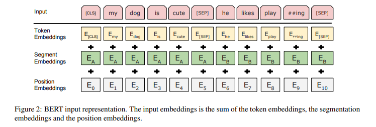

**Một số điểm cần chú ý**:

- Chúng ta sử dụng WordPiece embeddings (Wu et al., 2016) với một từ điển 30.000 từ và sử dụng `##` làm dấu phân tách. Ví dụng từ `playing` được tách thành `play##ing`.
- Chúng ta sử dụng **positional embeddings** với độ dài câu tối đa là 512 tokens.
- Token đầu tiên cho mỗi chuỗi được mặc định là một token đặc biệt có giá trị là [CLS]. Đầu ra của Transformer(hidden state cuối cùng) tương ứng với token này sẽ được sử dụng để đại diện cho cả câu trong các nhiệm vụ phân loại. Nếu không trong các nhiệm vụ phân loại, vector này được bỏ qua.
- Trong trường hợp các cặp câu được gộp lại với nhau thành một chuỗi duy nhất, chúng ta phân biệt các câu theo 2 cách. Đầu tiên, chúng ta tách chúng bở một token đặc biệt [SEP]. Thứ hai, chúng ta thêm một **segment embedding** cho câu A và một segment embedding khác cho câu B như hình vẽ.
- Khi chỉ có 1 câu đơn duy nhất, **segment embedding** của chúng ta chỉ có cho câu A.

## 2.3 Pre-training Tasks
Bây giờ, chúng ta sẽ tiếp tục với các nhiệm vụ để tạo ra mô hình cho BERT.

Chúng ta đào tạo BERT bằng cách sử dụng 2 nhiệm vụ dự đoán không giám sát được gọi là **Masked LM** và **Next Sentence Prediction**. Cả 2 sẽ được trình bày ngay trong phần nội dung dưới đây.

### Masked LM
Trực quan mà thấy, một mô hình học sâu được học dựa trên ngữ cảnh 2 chiều là tự nhiên và mạnh mẽ hơn nhiều so với một mô hình chỉ dùng ngữ cảnh từ trái qua phải (hoặc ngược lại).

Tuy nhiên, thật không may, các mô hình ngôn ngữ trước đây chỉ có thể đào tạo từ trái qua phải hoặc từ phải qua trái. Lý do được lý giải là vì khi sử dụng ngữ cảnh 2 chiều sẽ gây ra một nghịch lý là một từ có thể gián tiếp tự nhìn thấy nó trong một ngữ cảnh nhiều lớp.

Để đào tạo một mô hình tìm ra đại diện dựa vào ngữ cảnh 2 chiều, chúng ta sử dụng một cách tiếp cận đơn giản để che giấu đi một số token đầu vào một cách ngẫu nhiên và sau đó chúng ta chỉ dự đoán các token được giấu đi đó và gọi nhiệm vụ này như là một "masked LM"(MLM). Trong trường hợp này, các hidden vectors ở lớp cuối cùng tương ứng với các tokens được ẩn đi được đưa vào 1 lớp softmax trên toàn bộ tự vựng để dự đoán. Các nhà nghiên cứu của Google đã thử nghiệm mask 15% tất cả các token lấy từ từ điển của WordPiece trong câu một cách ngẫu nhiên là chỉ dự đoán các từ được mask.

Mặc dù điều này cho phép chúng ta có được một mô hình đào tạo 2 chiều, nhưng có 2 nhược điểm tồn tại. Đầu tiên là chúng ta đang tạo ra một sự không phù hợp giữa pre-train và fine-tuning vì các token được `[MASK]` không bao giờ được nhìn thấy trong quá trình tinh chỉnh mô hình. Để giảm thiểu điều này, chúng ta sẽ không phải lúc nào cũng thay thế các từ được giấu đi bằng token `[MASK]`. Thay vào đó, trình tạo dữ liệu đào tạo chọn 15% tokens một cách ngẫu nhiên và thực hiện các bước như sau:

Ví dụ với câu: `"con_chó của tôi đẹp quá"` Từ được chọn để mask là từ `"đẹp"`.

- Thay thế 80% từ được chọn trong dữ liệu huấn luyện thành token `[MASK]` --> `"con_chó của tôi [MASK] quá"`
- 10% các từ được chọn sẽ được thay thế bởi 1 từ ngẫu nhiên. --> `"con_chó của tôi máy_tính quá"`
- 10% còn lại được giữ không thay đổi --> `"con_chó của tôi đẹp quá"`

Transformer encoder không hề biết được từ nào sẽ được yêu cầu dự đoán hoặc từ nào đã được thay thế bằng một từ ngẫu nhiên, do đó, nó buộc phải giữ một biểu diễn theo ngữ cảnh của mối token đầu vào. Ngoài ra, do thay thế 1.5% tất cả các tokens bằng một từ ngẫu nhiên nên điều này dường như sẽ không làm ảnh hưởng tới khả năng hiểu ngôn ngữ của mô hình.

Nhược điểm thứ 2 của việc sử dụng MLM là chỉ có 15% tokens được dự đoán trong mỗi lô, điều này gợi ý cho ta 1 điều là có thể cần thêm các các bước sử dụng các pre-train model khác để mô hình hội tụ.

### Next Sentence Prediction
Nhiều nhiệm vụ quan trọng trong xử lý ngôn ngữ tự nhiên như **Question Answering** yêu cầu sự hiểu biết dựa trên mối quan hệ giữa 2 câu văn bản, không trực tiếp sử dụng được các mô hình ngôn ngữ. Để đào tạo được mô hình hiểu được mối quan hệ giữa các câu, chúng ta xây dựng một mô hình dự đoán câu tiếp theo dựa vào câu hiện tại, dữ liệu huẩn luyện có thể là một corpus bất kỳ nào. Cụ thể, khi chọn câu A và câu B cho mỗi training sample, 50% khả năng câu B là câu tiếp theo sau câu A và 50% còn lại là một câu ngẫu nhiên nào đó trong corpus.

Ví dụ:

**Input**: `[CLS] người đàn_ông làm [MASK] tại cửa_hàng [SEP] anh_ta rất [MASK] và thân_thiện [SEP]`

**Label**: `isNext`

**Input**: `[CLS] người đàn_ông làm [MASK] tại cửa_hàng [SEP] cô_ta đang cầm súng [SEP]`

**Label**: `notNext`

Chúng ta chọn những câu `notNext` một cách ngẫu nhiên và mô hình cuối cùng đạt được độ chính xác 97%-98% trong nhiệm vụ này.

# 3. Pre-training Procedure
Chúng ta sử dụng 2 bộ dữ liệu cho quá trình đào tạo là **BooksCorpus** (800M words) (Zhu et al., 2015) và **English Wikipedia** (2,500M words). Đối với Wikipedia, chúng ta chỉ trích xuất các đoạn văn bản và bỏ qua các danh sách, bảng và tiêu đề. Điều quan trọng là sử dụng một kho văn bản ở mức độ đoạn(bài văn) chứ không phải là một tập hợp các câu bị xáo trộn.

Để tạo ra một chuỗi đầu vào cho quá trình đào tạo, chúng ta lấy mẫu gồm 2 spans liên tiếp nhau trong corpus mà chúng ta tạm gọi đấy là các câu mặc dù chúng thường dài hơn nhiều so với các câu đơn thông thường(hoặc cũng có thể ngắn hơn). Chúng ta lấy mẫu sao cho sau khi kết hợp, chiều dài của mẫu kết hợp tối đa chứ 512 tokens. Các mask cho MLM vẫn được sử dụng sau khi áp dụng WordPiece tokenization với một tỷ lệ thống nhất là 15%.

# 4. Fine-tuning Procedure
Đối với các nhiệm vụ phân loại câu, BERT được fine-tuning rất đơn giản. Để có được biểu diễn của một chuối đầu vào với số chiều cố định, chúng ta chỉ cần lấy hidden state ở lớp cuối cùng, tức là đầu ra của lớp Transformer cho token đầu tiên(token đặc biệt `[CLS]` được xây dựng cho đầu chuỗi). Chúng ta gọi vector này là C (C∈R^H ) Chỉ có 1 tham số được thêm vào trong quá trình fine-tuning là `W∈R^(K∗H)` với K là số nhãn lớp phân loại. Xác suất của nhãn P là một phân phối với `P∈R^K` được tính toán bởi 1 hàm `softmax P = softmax(C*W^T)`. Tất cả các tham số của BERT và W được fine-tuning để tối ưu hóa hàm lỗi.

# 5. Các thử nghiệm của BERT
Kết quả fine-tuning của BERT đã đạt được kết quả tốt hơn nhiều so với các mô hình pre-train trước đó. Phần này chúng ta cùng xem qua một vài nhiệm vụ mà BERT đã thực hiện.

## 5.1 GLUE Datasets
**General Language Understanding Evaluation (GLUE)** là một tập các tập dữ liệu cho nhiệm vụ hiểu ngôn ngữ tự nhiên(NLU).

Những tập dữ liệu trong GLUE có thể kể đến bao gồm:

- **MNLI**: Multi-Genre Natural Language Inference là một nhiệm vụ phân loại sự đồng thuận của cộng đồng. Cho một cặp câu và mục đích là dự đoán liệu câu thứ 2 có phải là một câu tán thành, đối lập hay trung lập với câu đầu tiên.
- **QQP**: Quora Question Pairs là một nhiệm vụ phân loại nhị phân, mục tiêu là xác định xem hai câu hỏi được hỏi trên Quora có tương đương về mặt ngữ nghĩa hay không.
- **QNLI**: Question Natural Language Inference là một phiên bản của Stanford Question Answering Dataset đã được chuyển đổi thành một nhiệm vụ phân loại nhị phân. Các mẫu dương là các cặp câu hỏi và câu chứa đáp án, các mẫu âm là các cặp câu hỏi và câu không chứa đáp án cho câu hỏi.
- **SST-2**: Stanford Sentiment Treebank là một nhiệm vụ phân loại nhị phân một câu bao gồm các câu được trích xuất từ các bài đánh giá phim và được gán nhãn lại bởi con người về tình cảm/quan điểm của chúng.
- **CoLA**: Corpus of Linguistic Acceptability là một nhiệm vụ phân loại nhị phân một câu, mục tiêu là dự đoán một câu Tiếng Anh là chấp nhận được về mặt ngôn ngữ học hoặc không.
- **STS-B**: Semantic Textual Similarity Benchmark là một tập hợp các cặp câu từ các tiêu đề tin tức và các nguồn khác. Chúng được gán nhãn từ 1 đến 5 thể hiện mức độ tương tự về mặt ngữ nghĩa của chúng.
- **MRPC**: Microsoft Research Paraphrase Corpus bao gồm các cặp câu được tự động trích xuất từ các nguồn tin tức trực tuyến, được gán nhãn bởi con người thể hiện 2 câu có tương đồng về mặt ngữ nghĩa hay không.
- **RTE**: Recognizing Textual Entailment là một nhiệm vụ phân loại nhị phân tương tự như MNLI nhưng với ít dữ liệu hơn.

Mô hình được train với batch size bằng 32, training qua 3 epochs với hết dữ liệu trong tất cả các nhiệm vụ thuộc GLUE. Kết quả được thể hiện trong bảng dưới đây.

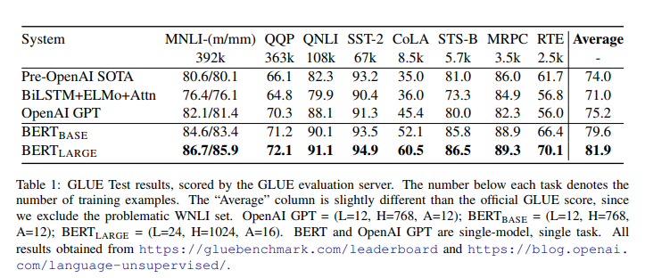

## 5.2 SQuAD v1.1
**Standford Question Answering Dataset (SQuAD)** là một tập dữ liệu gồm 100k sample được đóng góp bởi cộng đồng với cặp câu hỏi/ câu trả lời. Đưa ra một câu hỏi và một đoạn văn từ Wikipedia với nội dung chứa câu trả lời, nhiệm vụ là dự đoán xem đâu là câu(đoạn nhỏ) chứa câu trả lời. Ví dụ:

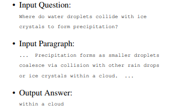

Nhiệm vụ dự đoán câu trả lời(đoạn chứa câu trả lời) này rất khác so với nhiệm vụ phân loại chuỗi của GLUE, nhưng chúng ta có thể điều chính BERT để chạy trên SQuAD một cách đơn giản. Cũng giống như GLUE, chúng ta biểu diễn câu hỏi đầu vào và đoạn văn trên Wikipedia như một chuỗi duy nhất cách nhau bởi token đặc biệt `[SEP]`.

Mô hình được đào tạo với 3 epochs, learning rate là 5e-5 và batch size là 32. Kết quả đạt được được thể hiện trong bảng dưới.

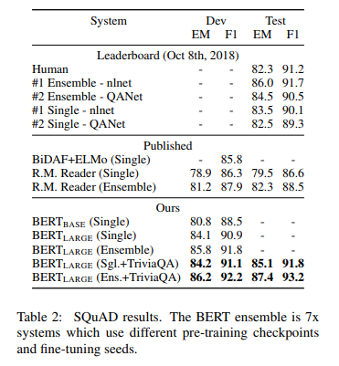

## 5.3 Named Entity Recognition
Đánh giá hiệu năng của một nhiệm vụ gán nhãn cho từng tokens, BERT đã fine-tuning trên tập dữ liệu CoNLL 2003 Named Entity Recognition (NER). Đây là tập dữ liệu gồm 200k từ được gán nhãn bằng tay với các nhãn là **Person**(tên người), **Organization**(tên tổ chức), **Location**(tên địa danh), **Miscellaneous**(tên sản phẩm,...) và Other (không phải thực thể có tên).

Để fine-tuning, chúng ta cần sử dụng trọng số ở lớp hidden cuối cùng cho mỗi token i là `T_i(T_i∈R^H)` cho vào một classification layer với tập label là số nhãn NER. Kết quả được thể hiện trong bảng dưới đây.

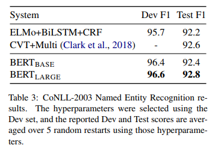

## 5.4 SWAG
**Situations With Adversarial Generations (SWAG)** là một tập dữ liệu chứ 113k ví dụ hoàn thành câu mà bạn phải đánh giá, suy luận để hoàn thành chúng. Với một câu từ tập dữ liệu, nhiệm vụ là quyết định xem trong bốn lựa chọn đó thì lựa chọn nào là hợp lý nhất.

Ví dụ:

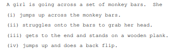

Việc sử dụng BERT trong nhiệm vụ của SWAG tương tư như khi áp dụng nó cho GLUE. Đối với mỗi ví dụ, chúng ta xây dựng 4 chuỗi đầu vào dựa trên 4 đáp án và câu ban đầu, mỗi chuỗi đó được ghép nối bởi câu đã cho(câu A) với câu ghép nối phù hợp(câu B).

Sau 3 epochs với learning rate bằng 2e-5 và batch size bằng 16. Kết quả mà Google đạt được được hiển thị dưới đây.

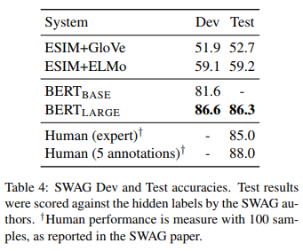

Mô hình của các bài toán trên được thể hiện trong hình dưới đây:

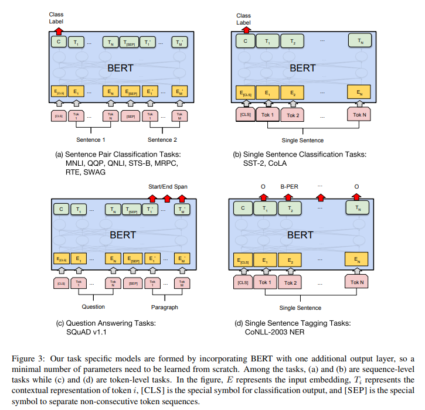

# 6. Source

[VIBLO - Phạm Hữu Quang](https://viblo.asia/p/hieu-hon-ve-bert-buoc-nhay-lon-cua-google-eW65GANOZDO)